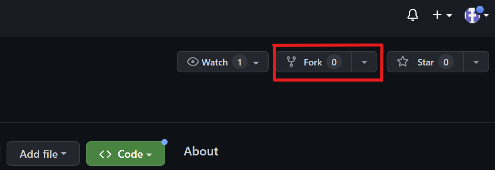
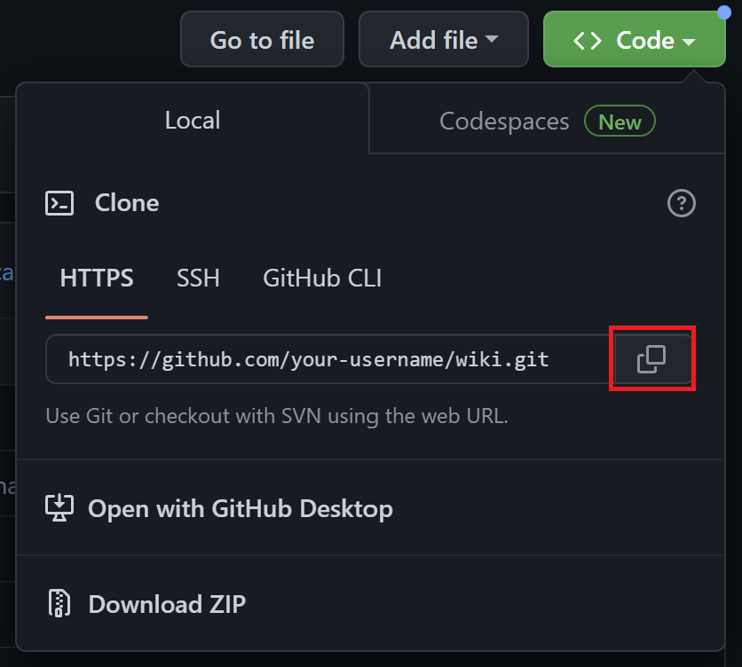
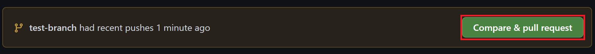
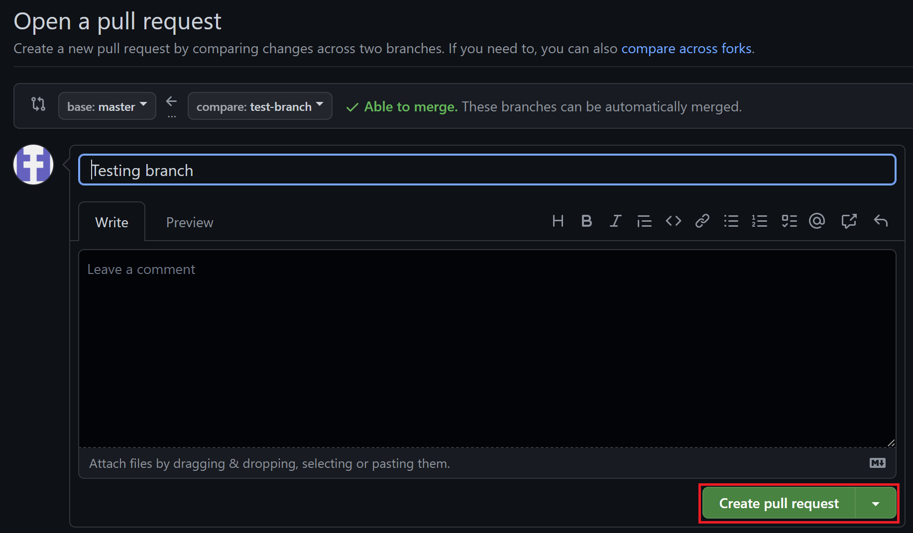

# Who Are We? 🍁

We are the Computing Councils of Canada. We are a not-for-profit organization created to foster a nation-wide community of computing students in Canada and to support computing councils in their quest to provide high-quality events and initiatives to their respective student bodies.

# What is the purpose of this project?

This project is a knowledge and resource hub for computing councils that either don't have the resources necessary to thrive or are just starting out and don't know where to begin. The open-source nature of this project allows experts from across Canada to contribute and share their wealth of knowledge with others so we can all succeed together.

# How you can contribute!

## 1. Downloading the Project and Running Locally

### Fork this repository

Fork this repository by clicking on the fork button on the top of this page.
This will create a copy of this repository in your account.

### Clone the repository



Now clone the forked repository to your machine. Go to your GitHub account, open the forked repository, click on the code button and then click the _copy to clipboard_ icon.

**Note: You will need the git command line interface for your machine. You can download it [here](https://git-scm.com/downloads)**

Open a terminal and run the following git command:

```
git clone "url you just copied"
```

where "url you just copied" (without the quotation marks) is the url to this repository (your fork of this project). See the previous steps to obtain the url.



For example:

```
git clone https://github.com/your-username/local-repo-name.git
```

where `your-username` is your GitHub username. Here you're copying the contents of the `local-repo-name` repository on GitHub to your computer.

## Create a branch

Change to the repository directory on your computer (if you are not already there):

```
cd local-repo-name
```

Now create and switch to a new branch using the `git checkout` command:

```
git checkout -b your-new-branch-name
```


## 2. Writing a New Guide
The documents on this site are written using Markdown: a lightweight markup language for creating formatted documents using plaintext.
If you are not familiar with how to write a Markdown document, check out [their guide](https://www.markdownguide.org/getting-started/)

### Creating a Directory
If your new guide falls under a different category than any of the directories already present, feel free to create your own! Under the `docs` directory create a new folder where you will put your guide. 
When creating a new directory you will need to create a new `_category_.json` file for it. This tells the site where to put the directory in the sidebar, what it should be called, and its description. Feel free to use the `event-directory` directory as an example!

### Creating a Document
In an existing directory, or, within the root of the `docs` directory create a new markdown file with an untaken name `[name-of-file].md`. Then, simply add your content and formatting to the page and save. 

### Adding Images
If your guide requires images, please save them to the `static/img` directory and reference the image in your markdown file
<br>
For example:
```
 
```
Results in:
 

## 3. Publishing Your Changes

### Add Files to Staging
If you go to the project directory and execute the command `git status`, you'll see there are changes marked in red.

Add those changes to the branch you just created using the `git add` command:

```
git add [file-name].md
```

Notice that if you run `git status` again, the files appear in green. This means they have successfully been added to the staging area.

### Commit Changes
You can commit your changes using the `git commit` command:

```
git commit -m "Example commit message"
```

In your commit message, indicate what you added/changed in the project

### Push to Remote Branch
Push your changes using the command `git push`:

```
git push -u origin your-branch-name
```

replacing `your-branch-name` with the name of the branch you created earlier.

### Open a Pull Request
If you go to your repository on GitHub, you'll see a `Compare & pull request` button. Click on that button.



Add a title and description to your pull request detailing your contributions and then submit the pull request.



### Sit back and Relax
One of our team members will review your changes and, once it's approved, your new document will be online! Don't forget to throw "open source project contributor" on your resume 😉

# See Mistakes or Misinformation?
Report them as an issue on this repo page and our team will address the problem. Or, make the change locally and submit a pull request using the above guide.